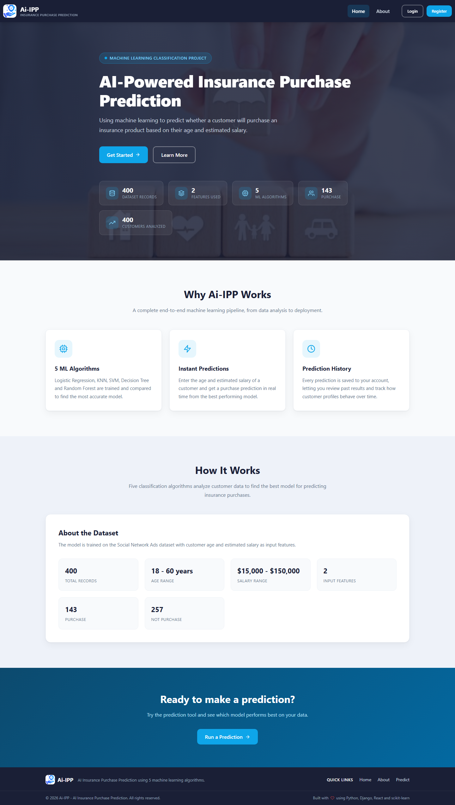
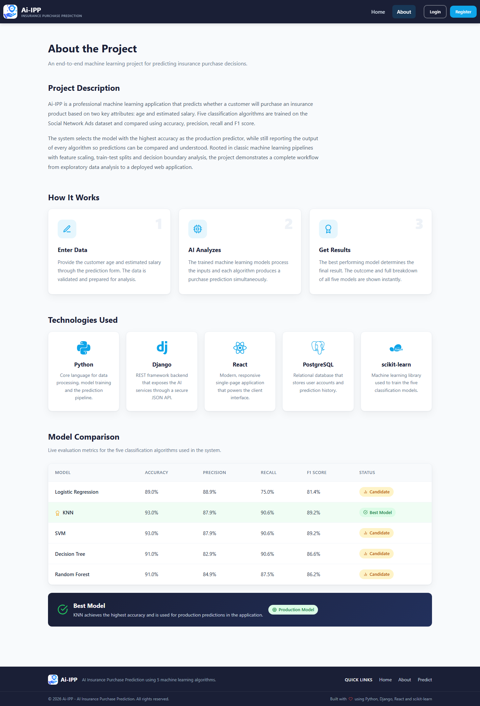
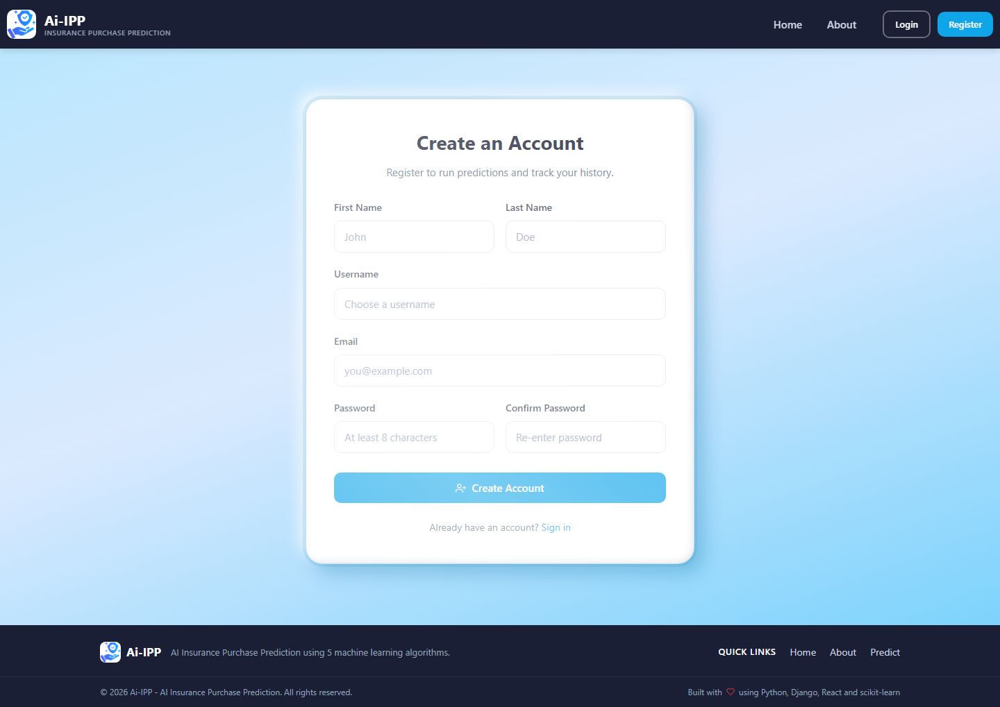
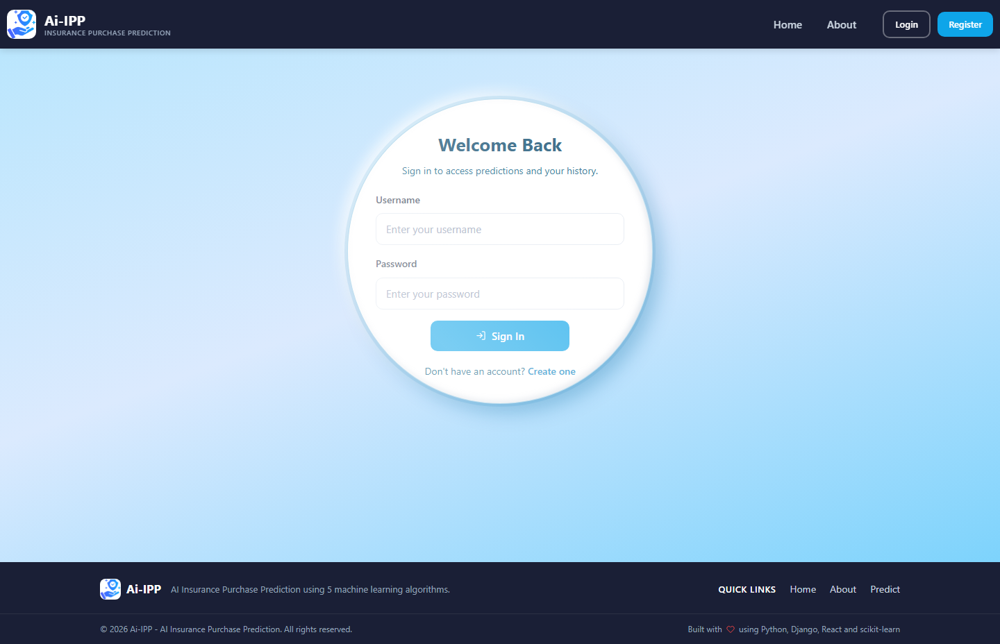
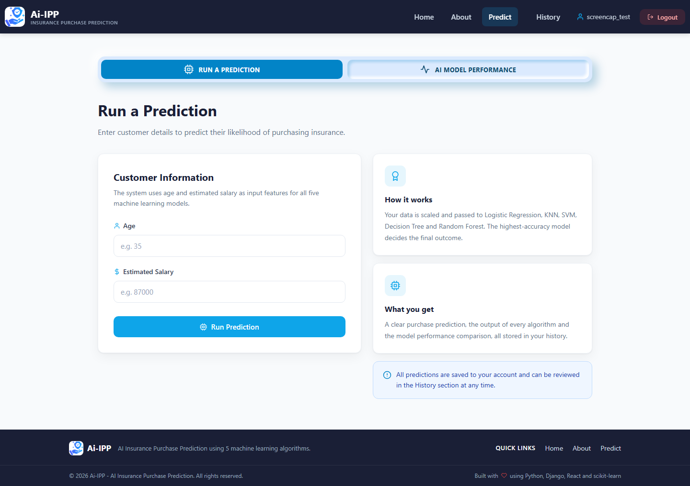
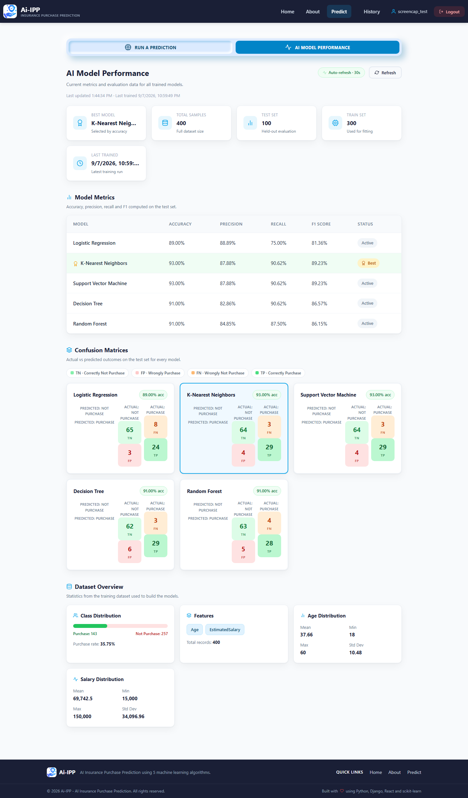
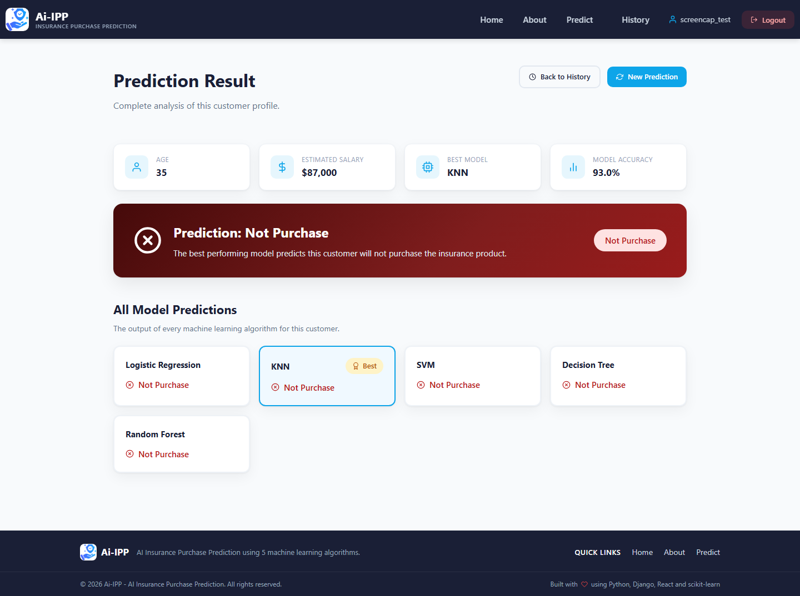
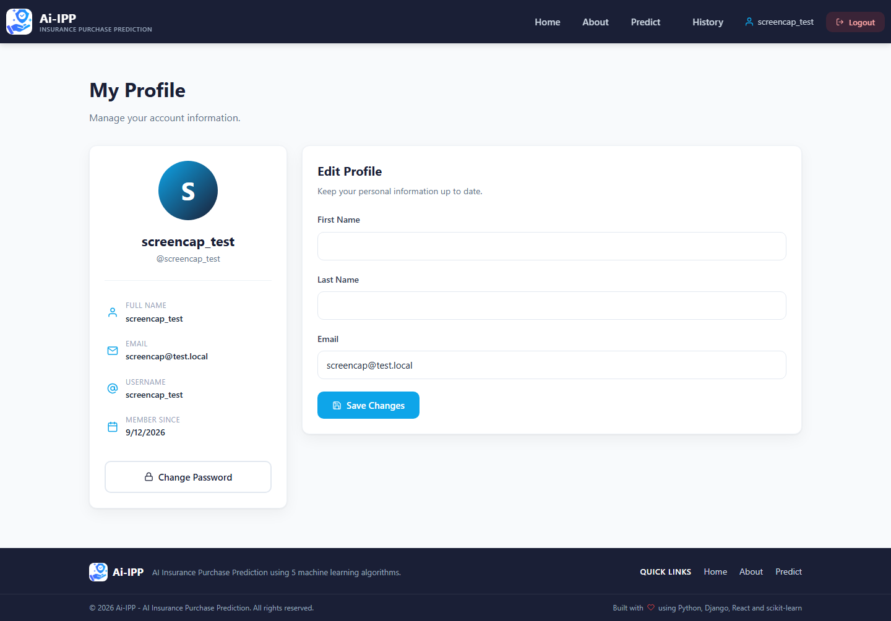
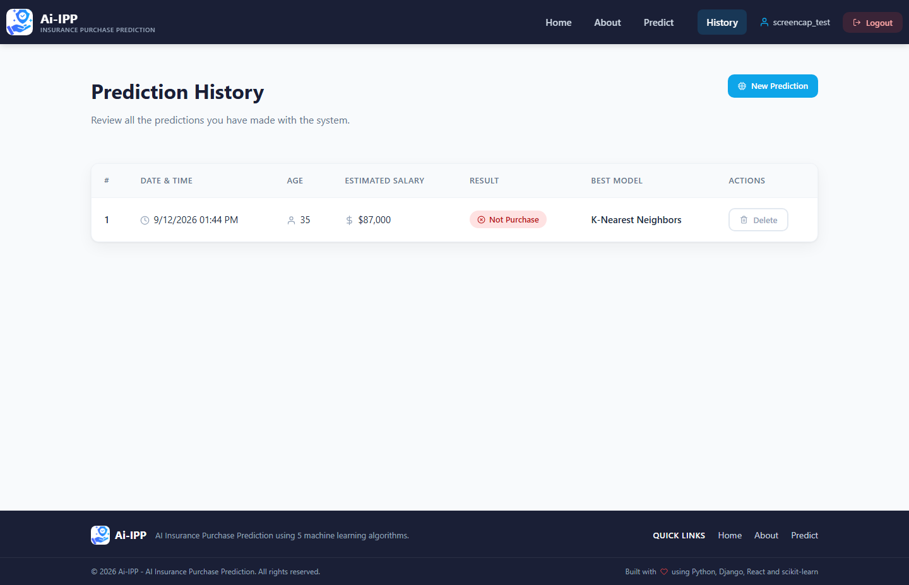

# AI Insurance — Insurance Purchase Prediction Platform

A full-stack machine-learning application for predicting insurance purchase outcomes from **age** and **estimated salary**. The project combines a Django REST API, a React frontend, PostgreSQL support, and a comparative classification pipeline.

## Video Demo

Watch the full application walkthrough — public pages, login, prediction form, model performance dashboard, prediction results, and prediction history:

▶️ **[View the full walkthrough recording](docs/recordings/full-tour.webm)**

The recording is a WebM video (1440×900). It is stored in the repository; GitHub's file viewer can render WebM previews for files below its size limit, or you can download the file and play it locally.

---

## Screenshots

### Home & Authentication

| | |
|---|---|
|  |  |
|  |  |
|  | |

### Prediction

| |
|---|
|  |

### Model Performance & Results

| |
|---|
|  |
|  |

### Profile & History

| |
|---|
|  |
|  |

---

## What It Does

The application accepts age and estimated salary as inputs, evaluates multiple classification models, identifies the configured best-performing model, and stores prediction history for authenticated users.

### Machine Learning

The training/prediction workflow evaluates:

- Logistic Regression
- K-Nearest Neighbors
- Support Vector Machine
- Decision Tree
- Random Forest

Model evaluation includes accuracy, precision, recall, F1 score, confusion matrices, and classification reports.

## Application Features

- JWT/token-based authentication
- Authenticated prediction requests
- Prediction history per user
- Best-model selection and model metrics returned with predictions
- Model-performance endpoint
- Dataset information endpoint
- React frontend for interacting with the prediction API
- PostgreSQL-ready Django backend
- Render Blueprint configuration for deployment
- Health-check endpoint at `/healthz/`

## Tech Stack

- **Backend:** Python, Django, Django REST Framework
- **Machine Learning:** scikit-learn, pandas, NumPy, joblib
- **Frontend:** React, React Router, Axios
- **Database:** PostgreSQL
- **Deployment:** Gunicorn, WhiteNoise, Render

## Project Structure

```text
ai_insurance/
├── backend/               # Django REST API and ML integration
│   ├── ai_insurance/      # Django project configuration
│   ├── accounts/          # Authentication and account APIs
│   ├── predictions/       # Prediction, history, metrics and dataset APIs
│   ├── ml/                # Model/pipeline implementation
│   └── requirements.txt
├── frontend/              # React application
├── docs/                  # Documentation media (screenshots + walkthrough video)
├── capture_pages.js       # Playwright script used to generate documentation media
├── main.py                # Standalone ML comparison/training example
├── Social_Network_Ads.csv # Dataset used by the standalone workflow
├── render.yaml            # Render deployment blueprint
└── README.md
```

## API

The backend exposes endpoints for authentication and prediction workflows. Core prediction routes include:

```text
POST /api/predictions/predict/
GET  /api/predictions/history/
DELETE /api/predictions/history/<id>/
GET  /api/predictions/model-performance/
GET  /api/predictions/dataset-info/
```

A health endpoint is available at:

```text
GET /healthz/
```

## Environment Variables

See `backend/.env.example` for the full reference. Key variables:

| Variable | Purpose |
|----------|---------|
| `DJANGO_SECRET_KEY` | Django secret (auto-generated on Render) |
| `DJANGO_DEBUG` | Enable/disable debug mode |
| `DJANGO_ALLOWED_HOSTS` | Comma-separated allowed hosts |
| `DATABASE_URL` | Production Postgres connection string (Render) |
| `DB_NAME`, `DB_USER`, `DB_PASSWORD`, `DB_HOST`, `DB_PORT` | Local database settings |
| `CORS_ALLOWED_ORIGINS` / `CSRF_TRUSTED_ORIGINS` | Allowed frontend origins |
| `REACT_APP_API_URL` | Frontend → API base URL override |

## Deployment

- **Backend + database:** the included `render.yaml` blueprint deploys the Django/ML API with a hosted PostgreSQL database. On startup it runs migrations, trains the models, and serves the API with Gunicorn.
- **Frontend:** the React app builds as static files (CRA) and is deployable to Vercel (`.vercel` configuration is included).

## Local Development

### Backend

```bash
cd backend
python -m venv .venv
# Windows: .venv\\Scripts\\activate
# macOS/Linux: source .venv/bin/activate
pip install -r requirements.txt
```

Configure the required environment variables, then run:

```bash
python manage.py migrate
python manage.py train_models
python manage.py runserver
```

### Frontend

```bash
cd frontend
npm install
npm start
```

### One-click setup (Windows)

```bat
setup.bat        REM creates the venv, installs dependencies, migrates, trains models
start-app.bat    REM starts the Django backend (:8000) and React frontend (:3000)
```

## Standalone ML Workflow

The root `main.py` demonstrates the end-to-end classification workflow using `Social_Network_Ads.csv`: data loading, preprocessing, model training, evaluation, comparison, best-model selection, visualization, and sample predictions.

## Important Note

This is a machine-learning demonstration and application project. Predictions are model outputs based on the supplied dataset and should not be treated as guaranteed insurance decisions or financial advice.

## License

No license file is currently defined in the repository. Please contact the repository owner for reuse or licensing questions.
